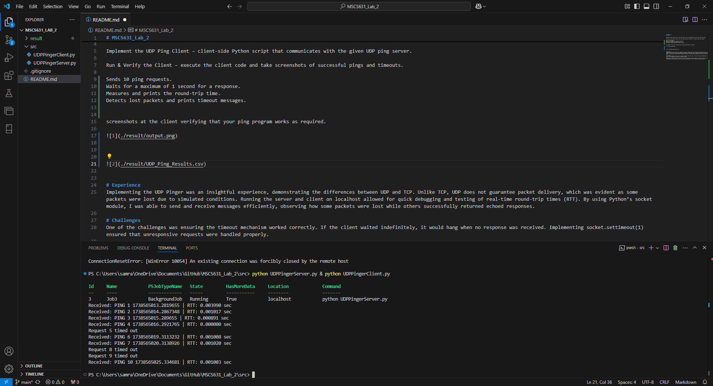
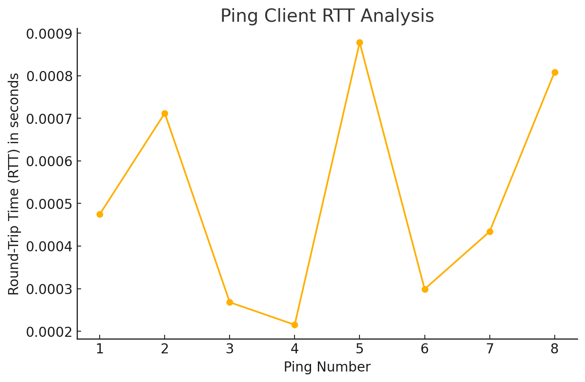

# MSCS631_Lab_2
UDP Pinger


Implement the UDP Ping Client – client-side Python script that communicates with the given UDP ping server.

Run & Verify the Client – execute the client code and take screenshots of successful pings and timeouts.

Sends 10 ping requests.
Waits for a maximum of 1 second for a response.
Measures and prints the round-trip time.
Detects lost packets and prints timeout messages.


screenshots at the client verifying that your ping program works as required. 





| Ping Results                                            |
|:--------------------------------------------------------|
| Request 1 timed out                                     |
| Received: PING 2 1738558170.6714246 | RTT: 0.001120 sec |
| Request 3 timed out                                     |
| Request 4 timed out                                     |
| Request 5 timed out                                     |
| Received: PING 6 1738558177.6804044 | RTT: 0.001224 sec |
| Received: PING 7 1738558178.682128 | RTT: 0.001285 sec  |
| Received: PING 8 1738558179.6842735 | RTT: 0.000978 sec |
| Request 9 timed out                                     |
| Request 10 timed out                                    |



```{r, echo=FALSE, warning=FALSE}
library(flextable) #you can use another table library, if you want
flextable(read.csv("./results/UDP_Ping_Results.csv"))
```

# Experience
Implementing the UDP Pinger was an insightful experience, demonstrating the differences between UDP and TCP. Unlike TCP, UDP does not guarantee packet delivery, which was evident as some packets were lost due to simulated conditions. Running the server and client on localhost allowed for quick debugging and testing of real-time round-trip times (RTT). By using Python’s socket module, I was able to send and receive messages efficiently, observing how some packets were lost while others successfully returned echoed responses.

# Challenges
One of the challenges was ensuring the timeout mechanism worked correctly. If the client waited indefinitely, it would hang when no response was received. Implementing socket.settimeout(1) ensured that unresponsive requests were handled properly. 

Additionally, since UDP does not establish a persistent connection, handling packet loss required retries and checking response consistency. Another challenge was running the server and client simultaneously while ensuring the server properly simulated packet loss for realistic network conditions.

